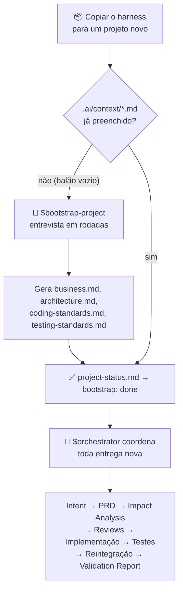

<div align="center">

# 🧠 God Harness

**Um esqueleto de engenharia para agentes de IA — que começa vazio e aprende o seu projeto perguntando.**

[](./LICENSE)
[](https://agents.md)
[](#)
[](#)

</div>

---

## O problema

Toda vez que você começa um projeto novo com um agente de IA, a mesma conversa se repete: explicar a stack, as convenções, onde ficam as regras de negócio, como rodar os testes — e depois torcer para que o agente não esqueça nada disso na entrega seguinte, não invente arquitetura, não pule teste, não misture duas mudanças na mesma entrega.

**God Harness** resolve isso de um jeito diferente: em vez de você escrever a documentação de contexto manualmente, o próprio harness te entrevista na primeira execução e gera essa documentação. E, a partir daí, todo pedido de funcionalidade ou correção passa por um processo fixo — entendimento → intenção → requisitos → análise de impacto → revisões → implementação → testes → validação — em vez de o agente sair editando código direto a partir de uma frase solta.

## Como funciona



Nenhuma outra skill roda antes do bootstrap. É a "Regra Zero" de `AGENTS.md`: se `.ai/context/project-status.md` disser `bootstrap: pending`, o agente só pode fazer uma coisa — rodar `$bootstrap-project`.

## Quickstart

```bash
# 1. copie o harness para dentro do repositório do projeto novo
cp -r god_harness/. meu-projeto-novo/

# 2. abra meu-projeto-novo com seu agente de IA (Claude Code, Codex CLI, Cursor...)
cd meu-projeto-novo

# 3. peça para o agente ler o AGENTS.md
```

> "Leia o AGENTS.md e siga o processo dele."

Como o projeto ainda não tem contexto, o agente vai automaticamente acionar `$bootstrap-project` e te entrevistar em rodadas — negócio, arquitetura, stack, padrões de código, testes e como você quer que o fluxo funcione. No final ele te mostra um resumo e só escreve os arquivos depois da sua confirmação.

Depois disso, para qualquer pedido novo, basta descrever o que você quer. O `$orchestrator` cuida do resto.

## Estrutura

```text
AGENTS.md                      # regra zero — todo agente lê isso antes de qualquer coisa
CLAUDE.md                      # ponteiro para AGENTS.md (compat. Claude Code)

.ai/
├── context/                   # a "memória" do projeto — gerada pelo bootstrap
│   ├── project-status.md      #   estado do bootstrap (pending | in_progress | done)
│   ├── business.md            #   negócio, usuários, indicadores
│   ├── architecture.md        #   módulos, stack, convenções
│   ├── coding-standards.md    #   padrões de código (base genérica + específicos)
│   └── testing-standards.md   #   padrões de teste (base genérica + específicos)
└── templates/                 # templates oficiais dos documentos de cada etapa
    ├── intent_template.md
    ├── prd_template.md
    ├── impact_analysis_template.md
    ├── test_plan_template.md
    ├── validation_report_template.md
    └── adr_template.md

.agents/skills/                # skills invocáveis pelo agente ($nome-da-skill)
├── bootstrap-project/         # entrevista inicial — cria o contexto do zero
├── orchestrator/              # coordena o fluxo completo ponta a ponta
├── create-intent/  create-prd/  impact-analysis/
├── architecture-review/  business-review/
├── security-review/  observability-review/
├── generate-tests/  implementation-review/  validate-delivery/
├── reintegrar-main/
└── (skills de Matt Pocock — ver abaixo)

docs/adr/                      # Architecture Decision Records + índice
intent/                        # Intent, PRD, análises e relatórios de cada entrega
scripts/governance-audit.sh    # audita a consistência da governança do repo
```

## O fluxo, ponta a ponta

```mermaid
flowchart LR
    I["💡 Ideia"] --> U["🗣️ Entendimento<br/>$grilling / $grill-me"]
    U --> INT["📄 Intent<br/>$create-intent"]
    INT --> PRD["📋 PRD<br/>$create-prd"]
    PRD --> IA["🔍 Impact Analysis<br/>$impact-analysis"]
    IA --> AR["🏛️ Architecture Review"]
    AR --> BR["💰 Business Review"]
    BR --> TK["🎫 Tickets<br/>$to-tickets (se necessário)"]
    TK --> IMPL["⚙️ Implementação"]
    IMPL --> T["🧪 Testes<br/>$generate-tests"]
    T --> REV["👀 Implementation /<br/>Security / Observability Review"]
    REV --> MAIN["🔀 Reintegração na main<br/>$reintegrar-main"]
    MAIN --> VAL["✅ Validation Report<br/>$validate-delivery"]
    VAL --> D["🚀 Entrega"]
```



Para bugs pequenos e correções de baixo risco, `$orchestrator` define uma **matriz de decisão** com um caminho simplificado (Intent leve → PRD leve → implementação → testes → validação) — o rigor é proporcional ao risco, não burocracia por burocracia.

## Filosofia

O processo é o mesmo para qualquer stack — Java, Node, Python, Rust, Flutter, o que for. O que muda é só o conteúdo de `.ai/context/*.md`, preenchido uma vez pelo bootstrap e evoluído ao longo do projeto (por você ou pelas próprias skills de revisão). As skills não sabem qual é a sua stack; elas leem o contexto para descobrir.

Alguns princípios que o harness impõe em `AGENTS.md`:

* **Intent → PRD → Código.** Nessa ordem de verdade. O código existente nunca justifica violar uma regra documentada.
* **Isolamento de contexto.** Cada Intent é uma frente isolada — nunca misture duas mudanças na mesma entrega.
* **Nada de "deve funcionar".** Testes são executados de verdade, com evidência, antes de qualquer entrega ser considerada concluída.
* **Segurança e isolamento multi-tenant não são opcionais** quando o projeto exige — são checklist obrigatório em `$security-review`.
* **Credenciais existentes nunca são removidas ou mascaradas** por suposição de que "devem estar em outro lugar".

## Skills incluídas

| Skill | O que faz |
|---|---|
| `$bootstrap-project` | Entrevista inicial — transforma o balão vazio no contexto real do projeto |
| `$orchestrator` | Coordena o fluxo completo, do entendimento à validação final |
| `$grill-me` / `$grilling` † | Entrevista relâmpago em rodadas para qualquer decisão a esclarecer |
| `$domain-modeling` † | Glossário de domínio (`CONTEXT.md`) e ADRs leves |
| `$to-tickets` † | Quebra uma entrega grande em tickets verticais com bloqueios explícitos |
| `$resolving-merge-conflicts` † | Resolve conflitos de merge preservando a intenção de cada lado |
| `$create-intent` | Transforma um pedido bruto em um problema bem definido |
| `$create-prd` | Transforma a Intent em requisitos testáveis |
| `$impact-analysis` | Mapeia o que pode quebrar antes de implementar |
| `$architecture-review` | Garante aderência à arquitetura existente |
| `$business-review` | Garante que a solução gera valor real |
| `$security-review` | Autenticação, autorização, isolamento, segredos |
| `$observability-review` | Logs, métricas, capacidade de diagnóstico em produção |
| `$generate-tests` | Plano de testes unitários, integração, E2E e regressão |
| `$implementation-review` | Qualidade técnica do código entregue |
| `$reintegrar-main` | Reintegra a entrega na `main` e publica em `origin/main` |
| `$validate-delivery` | Confronta PRD × código entregue, item por item |

† Skills públicas de [Matt Pocock](https://github.com/mattpocock/skills), incluídas quase verbatim.

## Compatibilidade

O harness usa [`AGENTS.md`](https://agents.md) como convenção — funciona com qualquer agente que leia esse arquivo (Claude Code, Codex CLI, Cursor, etc.). Um `CLAUDE.md` mínimo aponta para `AGENTS.md`, para ferramentas que procuram especificamente por esse nome.

## Créditos

Baseado no processo de governança usado no ecossistema [BJJ Control](https://bjjcontrol.com.br), generalizado para qualquer projeto, e incorporando as skills públicas de [Matt Pocock](https://github.com/mattpocock/skills).

## Licença

[MIT](./LICENSE) — use, copie, adapte, redistribua. Sem garantias.
